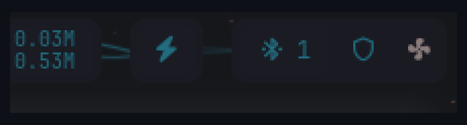

# Fan Monitor

An [Omarchy](https://omarchy.com) bar-widget plugin that shows a live fan-speed and temperature badge in your bar. Polls `lm_sensors` every 30 seconds; click opens a popup with per-fan RPM and per-chip temperatures (CPU package, board sensors, NVMe).


*(Fan icon, far right)*

## Features

- Live badge: normal color when cool, amber above 65°C, red above 80°C
- Badge color adapts to whichever bar it is installed on
- Popup with per-fan RPM — highlights stopped fans in red
- Popup with per-sensor temperatures (CPU, board, NVMe)
- Refreshes on popup open for instant feedback
- 30-second background polling

## Supported chips

| Chip | Data shown |
|---|---|
| `it8689` / `it87` | Fan speeds (RPM) + board temperatures |
| `coretemp` | CPU package temperature |
| `nvme` | NVMe composite temperature |

Other chips reported by `sensors -j` are silently ignored. Open an issue if your chip isn't listed.

## Requirements

- [Omarchy](https://omarchy.com) with Quickshell
- `lm_sensors` — install with `pacman -S lm_sensors`, then run `sudo sensors-detect`

## Installation

```
omarchy plugin add https://github.com/elynch303/fan-monitor.git
```

Then add it to your bar layout in `~/.config/omarchy/shell.json`:

```json
{ "id": "io.github.elynch303.fan-monitor" }
```

## License

MIT
